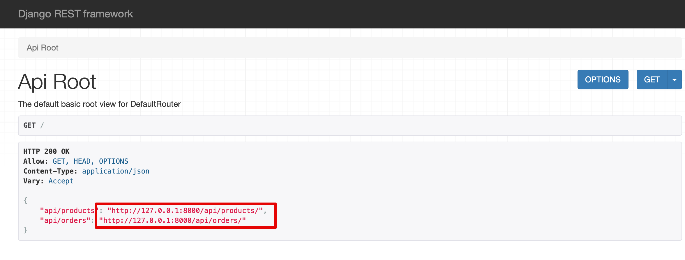
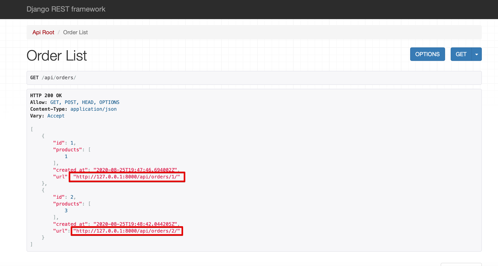

# REST API

## Task description
Let’s assume that we are building a next Amazon MVP - a retail that sells all kinds of products (dishwashers, laptops, t-shirts, everything). The frontend team is already working on frontend part, mobile team is working on mobile apps. You are responsible for backend and API that will be used by both frontend and mobile team.
Let’s assume that we already have endpoints for signing up and obtaining some kind of auth token that can be used later on.
Please design API endpoints to give frontend and mobile teams ability to build their User
Interfaces. This should include:
1. listing products
2. creating an order
3. updating an order
4. deleting an order
5. listing existing orders

#### Deliverables
Create github/gitlab repo with source code and documentation. You are free to chose any web framework and any database, including in memory persistence using Python dicts and lists.
Scoring
What is important in this task? and where we give points?
1. proper REST design - are you sure your API is RESTful?
2. extensive testing - are you sure all use cases are covered?
3. future proof - are you sure that after MVP the API is easily extensible and backward
compatible? we don’t want to create /v2 because /v1 can’t be extended. Figure out what
kind of extensions client could need in the future, make sure your API is future proof.
4. code and mind clarity, clearer the code, clearer the thinking. Make sure your code can be
read like breeze.

#### Other
If you have any questions, please just assume some defaults, you can list these assumptions in README.md

## Author's comments and assumptions
- In requirements, only listing products is mentioned. I then assumed, that adding products will be done in a different way than via API.
    - However, using ViewSets still allow us to extend the API. What kind of extensions client could need? 
    For example ability to create, update, destroy a product. This can be done by adding Mixin classes for instance. 
- There is no product quantity - due to lack of time I assumed that products are infinite :)
- ManyToMany relation - order can have many products, and a product can belong to different orders
- I created different serializers to:
    - have hyperlinks for orders on the order list
    - have only product primary keys (so ids) on the orders list to limit its size
    - have more details about products in the order detail view
- Basic tests have been added. If the time had allowed, I would have extended them with e.g.:
    - validation checks - if for instance "price" accepts values from the expected range only
    - functional tests - e.g. create order, add a product to order, remove the product from db, check if order is correct
- For demo purposes, I:
    - created a Dockerfile to easily start the API server
    - put a sample SQLite database to the repository with already added products and orders. Normally I wouldn't do that :)

## API server running & testing
All commands need to be executed from root folder of the repository.

#### Building the Docker image
`docker build -f docker/Dockerfile -t retailer:1.0 .`

#### Running API server with a sample database
Sample database already contains some products and orders. To run such server:

`docker container run --rm -p 8000:8000 retailer:1.0 sh -c "mv sample_db.sqlite3 db.sqlite3 && exec bash ./docker/django_run_server.sh"`

#### Running clean API server
`docker container run --rm -p 8000:8000 retailer:1.0`

We can also mount some directory to the docker container to preserve the database file(s).

#### Accessing API server
In the browser, go to: `http://127.0.0.1:8000`.
All available endpoints will be shown. You can click the hyperlink for a given endpoint to get redirected to it.

Order List also contains hyperlinks that allows you to move to the detail view of a given order.

#### Run tests
`docker container run --rm retailer:1.0 pytest -v -l tests/`

#### Run tests & code coverage
`docker container run --rm retailer:1.0 sh -c "coverage run --source='.' -m pytest -v -l tests/ && coverage report"`
